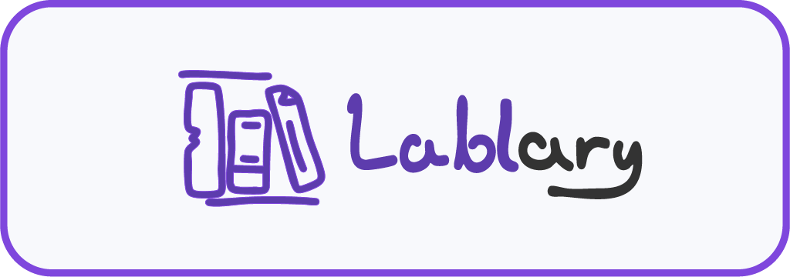
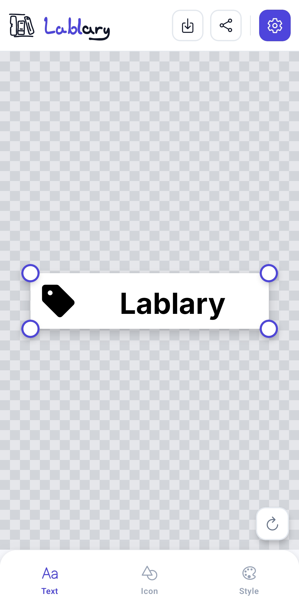
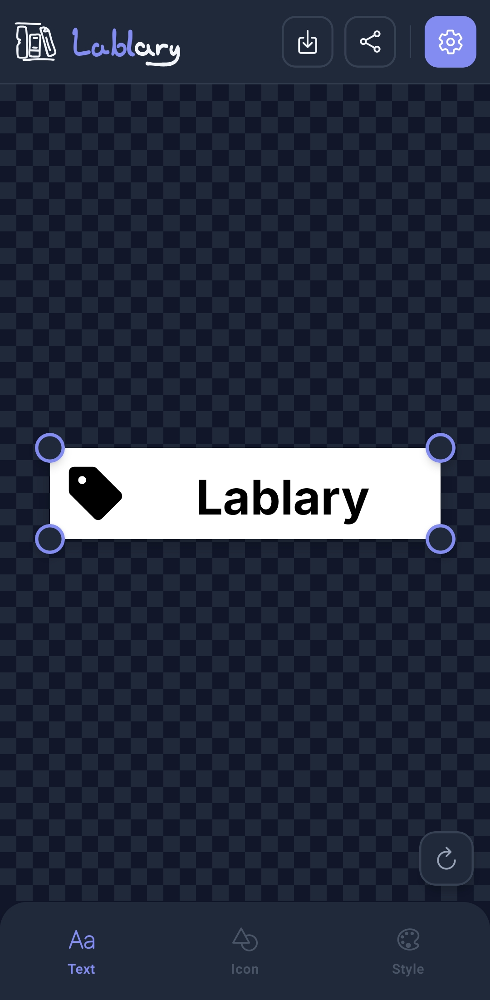
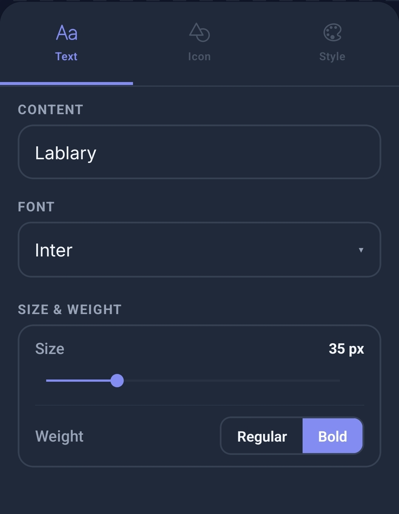
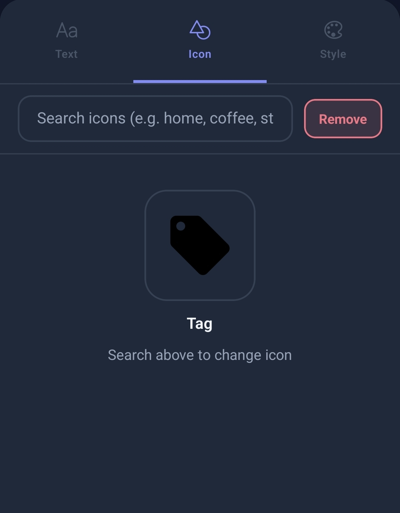
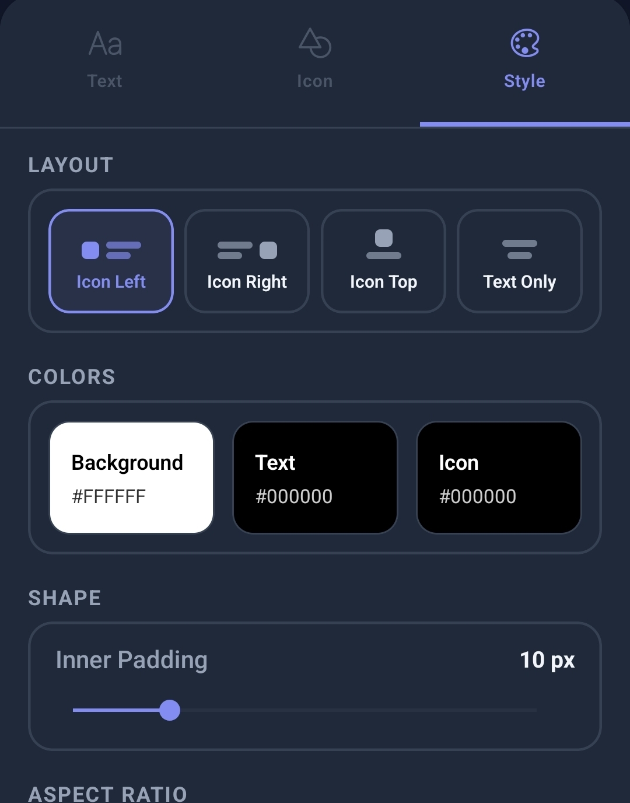

# Lablary

<!--  -->

**A mobile label design tool for people who own thermal printers and refuse to use the terrible apps that come with them.**

---

If you own a thermal label printer — a Niimbot, a DYMO, a Brother — you already know the frustration. The official apps are, to put it diplomatically, not great. Ugly interfaces, fonts that look like they were chosen by someone who had never *seen* a font before, icon libraries with about forty clipart-style images last updated in 2011, and customization options that feel like an afterthought.

I bought a Niimbot D110 to organize my home office. Cables, storage bins, chargers. Nothing fancy — just clean, consistent labels. What I wanted was simple: *pick an icon, type some text, make it look nice, and print it.* What the official app gave me was a 40-step journey through a UI that seemed actively hostile to that goal.

So I built Lablary instead.

---

## What It Is

Lablary is a **mobile label design studio** built with React Native and Expo. You open it, design a label on an interactive canvas, and export it as a PNG. That's the loop. No accounts, no cloud sync, no subscription tier that unlocks the good fonts.

The app is designed around thermal printer workflows — small, high-contrast labels that need to be legible at a glance and look like they belong together. But nothing stops you from designing labels for anything else.

---

## Features

**Text** — 10 Google Fonts (Inter, Roboto, Montserrat, Lato, Nunito, Oswald, Raleway, Playfair Display, Courier Prime, Pacifico), sizes 8–120px, regular/bold toggle, full color picker.

**Layout** — Four modes: icon left, right, top, or text only. Adjustable padding and border radius. Five aspect ratio presets (1:1, 2:1, 3:1, 4:3, 16:9) plus custom dimensions.

**Canvas** — Pinch to zoom (0.25×–4×), two-finger pan, drag handles to resize. The canvas renders exactly what gets exported, checkerboard background included.

**Icon Search** — Live search across 18+ icon libraries (Material Design, Lucide, Font Awesome, Phosphor, Tabler, and more) via the Iconify API. Filter by library for a consistent visual style.

**Defaults** — Set your preferred font, font size, weight, layout, and aspect ratio so every new label starts exactly where you left off.

**Export** — Save a PNG to your gallery, or share via the native OS sheet to send it to any app — including your printer's companion app. Export quality is configurable in settings.

> **Niimbot users:** The official Niimbot app doesn't accept images shared from other apps. To print directly from Lablary, use [NiimbotPrintHandlerApp](https://github.com/terratempest/NiimbotPrintHandlerApp) — a small open-source Android helper that receives the shared PNG and forwards it to your Niimbot over Bluetooth.

> **Other printers:** If your printer's app doesn't support "Share to print" natively, there may be an open-source solution that adds support for it. If you find one, let me know and I'll add it here so others can find it too.

---

## Screenshots

| Editor Light | Editor Dark |
|--------------|-------------|
|  |  |

| Text Tab | Icon Tab | Style Tab |
|-------------|-------------|-------------|
|  |  |  |

---

## Demo

| **Creating a label from scratch** | **Icon search in action** | **Export flow** |
|-----------------------------------|---------------------------|-----------------|
| picking a font, searching for an icon, tweaking the layout, and exporting | searching across 18+ icon libraries in real time | saving to gallery, sharing, and sending to a printer|
|  |  |  |

---

## Tech Stack

| Library | Role |
|---------|------|
| [React Native 0.81.5](https://reactnative.dev/) | Mobile UI framework |
| [Expo SDK 54](https://expo.dev/) | Build toolchain, native APIs |
| [react-native-reanimated](https://docs.swmansion.com/react-native-reanimated/) | All animations — canvas gestures, UI transitions, button feedback |
| [react-native-gesture-handler](https://docs.swmansion.com/react-native-gesture-handler/) | Pinch, pan, and tap gesture recognition |
| [@gorhom/bottom-sheet](https://gorhom.dev/react-native-bottom-sheet/) | Animated editor panel on phones |
| [NativeWind](https://www.nativewind.dev/) | Tailwind CSS utility classes for React Native |
| [Iconify API](https://iconify.design/) | Live icon search across 18+ libraries |
| [react-native-view-shot](https://github.com/gre/react-native-view-shot) | Canvas capture for PNG export |
| [expo-sharing](https://docs.expo.dev/versions/latest/sdk/sharing/) | Native OS share intent |
| [expo-media-library](https://docs.expo.dev/versions/latest/sdk/media-library/) | Save to device gallery |
| [expo-haptics](https://docs.expo.dev/versions/latest/sdk/haptics/) | Tactile feedback on button presses |

---

## Architecture

State is managed through custom hooks using a reducer pattern: `useLabel` owns the label design state, `useSettings` handles user preferences, and `useAdaptiveLayout` handles the phone/tablet split.

**On phones**, the canvas takes up the upper portion of the screen with the editor living in a bottom sheet that can be expanded or collapsed. A floating reset button sits over the canvas for quick style resets without opening the editor.

**On tablets** (≥768px wide), the layout shifts to a side-by-side view — canvas on the left, a fixed 320px editor panel on the right. No bottom sheet needed.

All animations — button press feedback, entrance transitions, the settings gear rotation, the download state indicator — are implemented with `react-native-reanimated` shared values and spring physics. Haptic feedback is layered on top of key interactions via `expo-haptics`.

---

## Future Ideas

A few things that would make Lablary genuinely more powerful:

- **Direct Bluetooth printer integration** — remove the need for a helper app entirely by speaking CPCL/ZPL or the Niimbot protocol directly.
- **Custom icon library** — upload your own SVG icons and use them alongside the Iconify libraries.
- **QR codes and barcodes** — useful for inventory, asset tracking, and the occasional nerd flex.
- **Icon favorites** — bookmark frequently used icons instead of searching every time.

---

## About

Lablary started as a Saturday afternoon project to get my home office organized. It's since turned into a small label design studio that I genuinely use every week. If you own a thermal printer and have ever stared at its official app in quiet despair, I hope this helps.

Built with Monsters and mild frustration by someone with too many unlabeled Boxes. 

---

*MIT License — do whatever you want with it.* 
